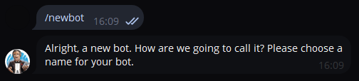

# :lucide-bell-dot: Телеграм оповещения

## :lucide-info: Введение

В этой статье я расскажу как создать и подключить Telegram-бота для оповещений о рыбалке.

---

## :lucide-bot: Создаём бота через @BotFather

Для начала необходимо создать бота, через которого будут поступать уведомления. В этом поможет [BotFather](https://telegram.me/BotFather) — официальный бот Telegram для управления другими ботами.

Введите команду `/newbot`, чтобы начать процесс создания.

<figure markdown="span">
  { width="720" }
</figure>

### Шаг 1: Выбор имени для бота

После команды `/newbot` BotFather предложит выбрать имя для вашего бота. Это может быть любое имя, которое вам нравится, например `FishingBotNotify`.

<figure markdown="span">
  { width="720" }
</figure>

### Шаг 2: Придумайте уникальный юзернейм

Затем укажите уникальный юзернейм, который должен оканчиваться на **`bot`**. Например: `FishingBotAlerts_bot`. Если имя доступно, BotFather создаст бота и сгенерирует **API-токен**.

!!! danger "Важно!"
    Скопируйте токен и вставьте его в соответствующее поле в программе — это ключ к управлению вашим ботом.

<figure markdown="span">
  { width="720" }
</figure>

### Шаг 3: Авторизация

У вас есть на выбор два способа авторизации:

1. **По имени пользователя:** Укажите ***username*** Telegram, который будет получать уведомления. Username — это часть после `@` в вашем нике (например, если ваш ник `@dyflow` — укажите `dyflow` без символа `@`, с учётом регистра).
2. **По паролю** Используйте пароль, который был автоматически задан в настройках программы. При желании его можно сменить.

!!! danger "Важно!"
    Чтобы бот мог начать отправку уведомлений, вы обязательно должны написать ему первым. Пока этого не произойдет, бот не сможет работать:

    * Если вы используете username: отправьте боту любое сообщение.
    * Если вы используете пароль: отправьте боту ваш пароль.

<figure markdown="span">
  { width="620" }
  <figcaption>Правильно заполненные поля</figcaption>
</figure>

---

## :lucide-rocket: Запуск и настройка оповещений

После того как все поля заполнены, запустите бота через кнопку в программе. Настройка параметров оповещений осуществляется через самого Telegram-бота.

!!! tip "Быстрый переход к боту"
    После создания через BotFather нажмите на ссылку, которую он отправил (например, `t.me/ИмяВашегоБота`). Она откроет диалог с ботом прямо в Telegram, где можно сразу отправить первое сообщение или пароль.

<figure markdown="span">
  { width="620" }
  <figcaption>Настройки оповещений в Telegram-боте</figcaption>
</figure>
