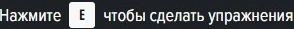

# :lucide-wrench: Jobs Launcher Инструкция

## :lucide-star: Введение
Статья будет дополняться и улучшаться по мере обновлений помощника. Если у вас возникнут вопросы, **пожалуйста полностью просмотрите эту статью**,прежде чем писать на FunPay. 

Благодарю за понимание и надеюсь, что бот сделает вашу работу ещё более удобной!

---

## :lucide-wrench: Ошибки и решения
### Не удалось загрузить файл или сборку...
!!! bug "Пример ошибки"
    Не удалось загрузить файл или сборку ... либо одну из их зависимостей. Произошел сбой в программе инициализации библиотеки динамической компоновки

**Как исправить:**

1. Скачайте и установите **.NET** с [официального сайта Microsoft](https://dotnet.microsoft.com/en-us/download/dotnet-framework/net481).
2. Скачайте и установите **VC++ Redistributable** [по этой ссылке](https://aka.ms/vs/17/release/vc_redist.x64.exe).
3. Если не помогло - полностью удалите старые версии VC++ через «Панель управления» и установите заново.
4. В крайнем случае - переустановите саму программу, проверьте чтобы распаковались все файлы из архива.

### Произошла ошибка или первышено ожидание во время запроса
**Как исправить:** 

* Если используете VPN или средства обхода блокировок — попробуйте их отключить. 
* В некоторых случаях помогает обратное действие — включение VPN (если ваш провайдер блокирует соединение).

---

## :lucide-wallpaper: Настройка экрана и графики

Для корректной работы программы должны быть соблюдены следующие условия:

* **Разрешение:** Строго `1920x1080` (FullHD).
* **Тип экрана:** *Полный экран* или *Оконный без рамки*.
!!! danger "Важно!"
    Если вы используете режим *Оконный без рамки*, но при этом по краям окна с игрой у вас есть рамки, то бот работать **не будет**, игра должна быть на весь экран <figure markdown="span">
      { width="700" }
      <figcaption>*Как НЕ должно быть*</figcaption>
    </figure>
* **Формат:** Соотношение сторон в игре должно быть *16:9*.
* **Подсказки:** В углу экрана должны быть видны игровые подсказки, включаются клавишей ++f5++.  <figure markdown="span">
      { width="400" }
    </figure>
* **Фильтры:** Отключите **NVIDIA Freestyle**, редуксы или цветокоррекцию - они могут менять цвета, которые ищет программа. Иногда помогает             временное выключение **GeForce Experience** и других оверлеев.
* **Шрфит:** В настройках маджестика должен быть выбран шрифт `ProximaNova`. В системе должно быть активно сглаживание системных шрифтов.
???+ question "Как сменить шрифт в игре?"
    Игровой шрифт можно изменить через F2 -> Настройки -> Основное -> Дополнительно -> Общий шрифт
???+ question "Как включить сглаживание системных шрифтов?"
    
    1. Нажмите клавиши ++win+r++ на клавиатуре, либо нажмите правой кнопкой мыши по кнопке «Пуск» и выберите пункт «Выполнить».
    2. Введите команду `sysdm.cpl` и нажмите кнопку «Ок» или клавишу ++enter++.
    3. Перейдите на вкладку «Дополнительно» в окне «Свойства системы» и нажмите кнопку «Параметры» в разделе «Быстродействие».
    4. Проверьте чтобы на пункте "Сглаживание неровностей экранных шрифтов" стояла галочка

!!! tip "Нужна помощь?"
    Если вы проверили всё описанное выше, но бот не работает, напишите мне в личные сообщения на **FunPay**, постараюсь вам помочь.

---

## :lucide-turtle: Оптимизация для слабых ПК

Если бот медленно реагирует, попробуйте повысить приоритет процесса:

1. Запустите бота.
2. Откройте **Диспетчер задач** (нажмите ++ctrl+shift+esc++).
3. Перейдите во вкладку **Подробности** (Details).
4. Найдите `JobsLauncher.exe`
5. Правой кнопкой мыши → **Задать приоритет** → **Выше среднего** или **Высокий**.

!!! warning "Внимание"
    Не выбирайте приоритет **Реального времени** - это может привести к нестабильной работе всей Windows.

---

## :lucide-rocket: Описание функций

### :lucide-sport-shoe: Авто-бег
Это функция, которая избавляет вас от необходимости постоянно зажимать клавиши бега на клавиатуре. Персонаж бежит сам, а ваши пальцы отдыхают.
Проще говоря: **Бот бежит вперед сам, вы просто ведете его мышкой в нужную сторону.**

!!! question "На каких работах есть авто-бег?"

    * Апельсины
    * Карьер / Шахта
    * Грибник
    * Лесоруб