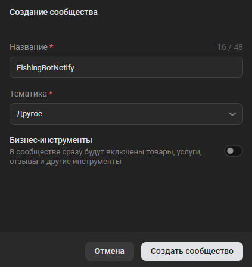
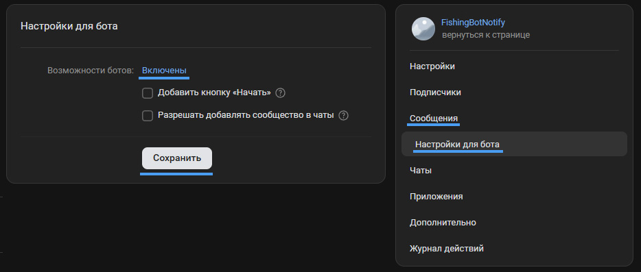
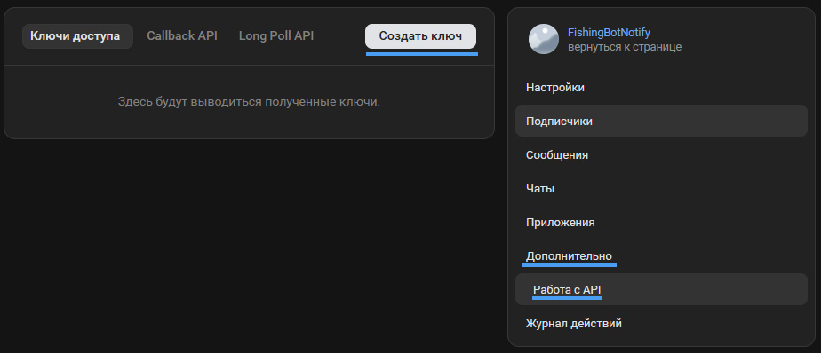
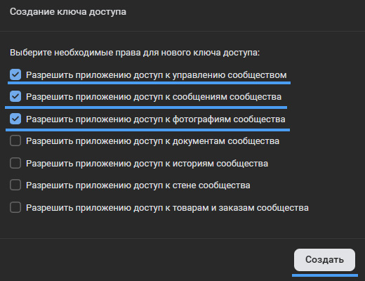
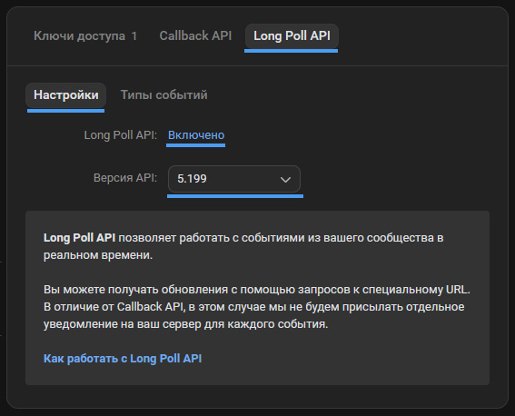
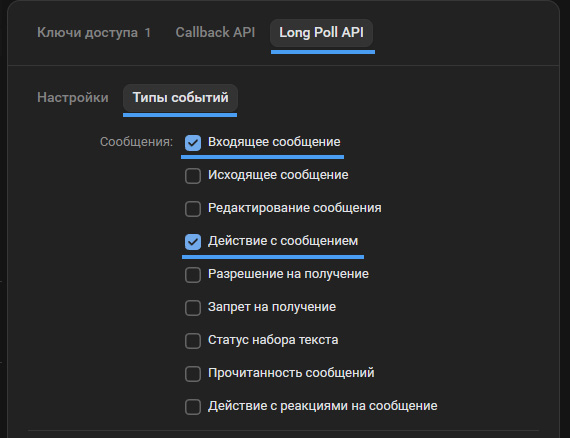
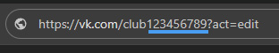
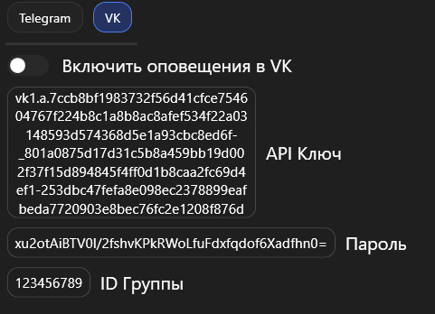
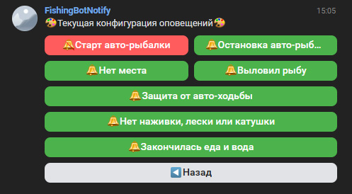

# :lucide-bell-dot: ВКонтакте оповещения

## :lucide-info: Введение

В этой статье подробно описан процесс создания и настройки собственного сообщества ВКонтакте для получения оповещений о рыбалке.

---

## :lucide-users: Создание и настройка сообщества

Для начала необходимо создать группу, через которую программа будет присылать вам уведомления. Перейдите в раздел [Сообщества](https://vk.com/groups) и нажмите кнопку **«Создать сообщество»**.

### Шаг 1: Базовые настройки сообщества

Выберите любую тематику и задайте понятное название (например, `FishingBotNotify`). Тип группы в настройках рекомендуется установить как **«Частная»** — так доступ к группе будет только у вас.

<figure markdown="span">
  { width="420" }
</figure>

### Шаг 2: Включение сообщений и возможностей ботов

Чтобы бот мог присылать уведомления, необходимо правильно настроить диалоги сообщества:

1. Перейдите в **Управление** → **Сообщения** и убедитесь, что Сообщения сообщества **Включены**. Сохраните изменения.
2. Там же, в меню справа, перейдите в подраздел **Настройки для бота**.
3. В пункте «Возможности ботов» выберите **Включены** и снова нажмите «Сохранить».

<figure markdown="span">
  { width="820" }
</figure>

---

## :lucide-key: Получение API-ключа

### Шаг 3: Создание ключа доступа

В меню управления сообществом перейдите в раздел **Дополнительно** → **Работа с API** → вкладка **Ключи доступа**. Нажмите кнопку **«Создать ключ»**.

<figure markdown="span">
  { width="820" }
</figure>

### Шаг 4: Выбор прав доступа

В появившемся окне обязательно отметьте следующие права:

- [x] **Управление сообществом**
- [x] **Сообщения сообщества**
- [x] **Фотографии**

!!! danger "Важно!"
    Без этих прав программа не сможет корректно взаимодействовать с сообществом (например, присылать картинки или сами уведомления). Убедитесь, что все три пункта отмечены перед сохранением.

<figure markdown="span">
  { width="520" }
</figure>

!!! danger ""
    Подтвердите создание ключа. **Полностью скопируйте полученный токен** — он длинный, понадобится для ввода в программу.

---

## :lucide-zap: Настройка Long Poll API

### Шаг 5: Включение Long Poll API

Оставаясь в разделе **«Работа с API»**, перейдите на вкладку **«Long Poll API»**. Включите его и выберите версию API **`5.199`**.

<figure markdown="span">
  { width="620" }
</figure>

### Шаг 6: Включение типов событий

На этой же странице перейдите на соседнюю вкладку **«Типы событий»** и включите следующие пункты:

- [x] **Входящее сообщение**
- [x] **Действие с сообщением**

!!! tip "Заметка"
    Остальные типы событий можно оставить выключенными — они не требуются для работы уведомлений.

<figure markdown="span">
  { width="620" }
</figure>

---

## :lucide-hash: Получение ID группы

### Шаг 7: Идентификатор сообщества

**ID** — это уникальный числовой идентификатор вашего сообщества.

Его можно найти двумя способами:

1. В адресной строке браузера при открытом сообществе (например, в адресе `vk.com/club123456789` нужным ID будет часть **`123456789`**).
2. В разделе **Управление** → **Основная информация**.

Скопируйте эти цифры, они также понадобятся в программе.

<figure markdown="span">
  { width="620" }
</figure>

---

## :lucide-rocket: В программе

### Шаг 8: Ввод данных

Вернитесь в программу и заполните два обязательных поля:

1. **API Ключ** — токен доступа, который вы скопировали на Шаге 4.
2. **ID группы** — числовой идентификатор сообщества, полученный на Шаге 7.

!!! example "Заметка"
    Для авторизации в созданном боте используйте пароль, который был автоматически задан в настройках программы. При желании его можно сменить.

<figure markdown="span">
  { width="620" }
  <figcaption>Пример заполненных полей</figcaption>
</figure>

### Шаг 9: Запуск и активация бота

После заполнения всех полей запустите бота через кнопку в программе.

!!! danger "Обязательное действие!"
    Чтобы бот мог начать отправку уведомлений, вы обязательно должны написать ему первым. Пока этого не произойдет, бот не сможет работать. Например первым сообщением может быть пароль для авторизации.

Дальнейшая детальная настройка параметров оповещений осуществляется уже в диалоге с вашим ботом.

<figure markdown="span">
  { width="620" }
  <figcaption>Настройки оповещений в диалоге ВКонтакте</figcaption>
</figure>